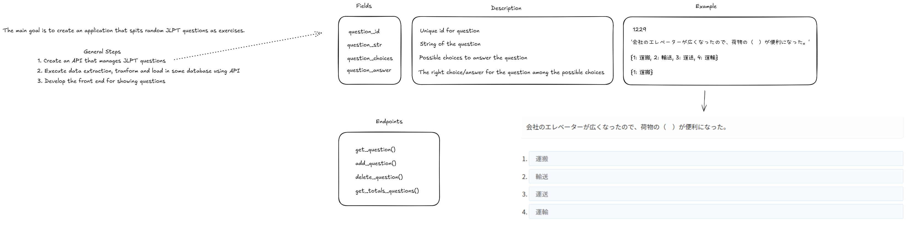

# Goal

The main goal is to create an application that spits random JLPT questions as exercises.

Rules
1. I should be able to select 1 out of 4-5 answers and the app tells me if it's right.
2. If it's wrong, it should tell me why I got it wrong.
3. The questions should appear in random order.
4. If I got a question right, it shouldn't show me it again, at least, not in the same session.

# How to Run API?
1. First create a virtual environment for python
`python3 -m venv env`

2. Go to API folder and run app.py
`cd api`
`python3 app.py`

# How to Run FRONT?
1. Go to Front folder and run app.py using streamlit
`streamlit run app.py`

## Front Working

## API Working:

## Database fields:

## Initial thoughts:

